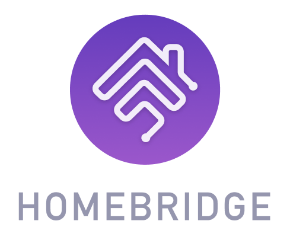
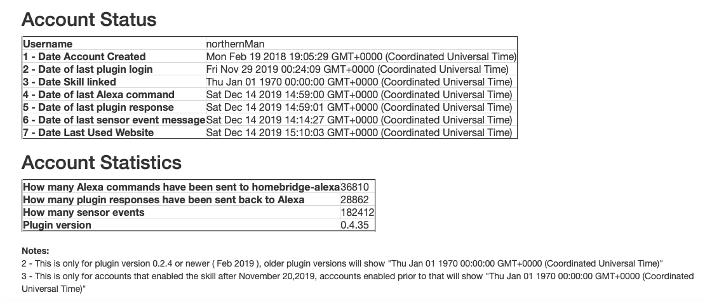

**homebridge-alexa** Version 2 - Home Skill Based

[](https://npmjs.org/package/homebridge-alexa)

<p align="center">
    
</p>

Enable Amazon Alexa to control your homebridge smart home devices and accessories.  Please note, that this does **NOT** bring Alexa enabled devices into homebridge, for this please try [homebridge-alexa-smarthome](https://github.com/joeyhage/homebridge-alexa-smarthome).  Full support for all Amazon Alexa devices, including the echo 2nd Generation and software based solutions.  Uses an Amazon smart home skill based approach for integration between HomeBridge and Amazon Alexa.

# Note to users of the service

Everyone, as your probably aware we have been running this for a number of years as a free service, and with the growth in users of the service and the volume of transactions flowing thru the cloud components we need to change to a subscription based service to continue to offer the service in a sustainable manner.

The ongoing costs to run and support the cloud services have grown to the point where it is larger than pocket change, and rather than reducing functionality we have made the hard decision to switch to a subscription based model to continue to offer the current high levels of service.

For the subscription model, we have set this up with PayPal to start with, and with a price cheaper than a cup of Starbucks coffee. We thought a coffee a month was a reasonable contribution for the continued delivery of service.

## New Users

For new users of the service, they will receive a trial account, with 7 days of service to test out the service and work thru any issues prior to a subscription being required to continue service.  During the trial period users can apply for a subscription at any time, and it will be future dated to start on the trial period end date. 
 
# Availability

Country availability - The plugin is available in these countries, English (AU), German (DE), English (CA), English (US), French (FR), English (UK), Italian (IT), English (IN), Spanish (ES), Japanese (JP), Spanish(US), Portuguese (BR) and Spanish (MX).

# Features

* Supports multiple homebridge instances running on your network.
* Auto-discovery of multiple Homebridge's
* Supports the following HomeKit accessory types Lightbulb, Outlet, Fan, Fan2, Temperature Sensor, Window Coverings, Garage Doors and Switches.
* Supports passing of sensor updates in real time to Alexa for use in routines.
* Includes support for brightness and colour.
* Creates a Contact Sensor that monitors the status of the connect to the Homebridge Alexa Cloud Servers.
* The plugin does not need to be installed in your 'main' homebridge instance.  It can be installed in any 'Homebridge' instance in your setup.
* Enables control from non-hardware based alexa devices like Invoxia Triby, and AlexaPI.

# Table of Contents
<!--ts-->
* [Note to users of the service](#note-to-users-of-the-service)
   * [New Users](#new-users)
* [Availability](#availability)
* [Features](#features)
* [Table of Contents](#table-of-contents)
* [Supported devices](#supported-devices)
   * [HomeKit/Homebridge Devices supported](#homekithomebridge-devices-supported)
      * [Native Support](#native-support)
      * [Supported as Other Types](#supported-as-other-types)
      * [Non-Homebridge Devices](#non-homebridge-devices)
   * [Unsupported device types](#unsupported-device-types)
* [Alexa Voice Commands](#alexa-voice-commands)
   * [Setup](#setup)
   * [Light bulbs / Switches / Dimmer Switches](#light-bulbs--switches--dimmer-switches)
   * [Color lights](#color-lights)
   * [Color temperature](#color-temperature)
      * [Color Temperatures](#color-temperatures)
   * [Garage door, Blinds and Window Coverings](#garage-door-blinds-and-window-coverings)
      * [Garage Door With door = false](#garage-door-with-door--false)
      * [Window coverings / blinds With blind = false](#window-coverings--blinds-with-blind--false)
      * [Garage Door With blind = true ( Not supported in all countries )](#garage-door-with-blind--true--not-supported-in-all-countries-)
      * [Window coverings / blinds With blind = true ( Not supported in all countries )](#window-coverings--blinds-with-blind--true--not-supported-in-all-countries-)
   * [Thermostat's and Heater / Cooler's](#thermostats-and-heater--coolers)
   * [Lock / Unlock Doors](#lock--unlock-doors)
   * [Temperature sensors](#temperature-sensors)
   * [AppleTV ( homebridge-apple-tv or homebridge-apple-tv-remote )](#appletv--homebridge-apple-tv-or-homebridge-apple-tv-remote-)
   * [HomeKit Television](#homekit-television)
      * [HomeKit Television - Tested plugins](#homekit-television---tested-plugins)
      * [Television Inputs and Channels](#television-inputs-and-channels)
   * [Speakers](#speakers)
      * [Bose SoundLink - Change preset](#bose-soundlink---change-preset)
   * [Yamaha Receiver/Spotify control](#yamaha-receiverspotify-control)
   * [Contact and Motion Sensors](#contact-and-motion-sensors)
   * [Door bell devices](#door-bell-devices)
* [Installation of homebridge-alexa](#installation-of-homebridge-alexa)
* [Service Availability and Issues](#service-availability-and-issues)
   * [Homebridge cloud service monitoring ( homebridge.ca )](#homebridge-cloud-service-monitoring--homebridgeca-)
   * [Raising Issues and Troubleshooting](#raising-issues-and-troubleshooting)
      * [Troubleshooting](#troubleshooting)
      * [Known Issues](#known-issues)
      * [Discord Channel](#discord-channel)
      * [Debug logs](#debug-logs)
      * [Homebridge Accessory Dump](#homebridge-accessory-dump)
* [Roadmap](#roadmap)
* [Credits](#credits)

<!-- Created by https://github.com/ekalinin/github-markdown-toc -->
<!-- Added by: runner, at: Wed Dec 13 14:15:55 UTC 2023 -->

<!--te-->

# Supported devices

* Support for Light Bulbs, Switches and outlets
* Support for Color Light Bulbs and Colour Temperature of white Light bulbs
* Support for Fans (As Alexa doesn't support Fans coverings I'm using Other)
* Support for Window coverings/blinds
* Support for Garage Doors
* Support for Temperature, Contact and Motion Sensors.  
* Support for Occupancy Sensors as a Contact sensor.  
* Also supports sending real time updates from Contact, Occupancy and Motion sensors to Alexa, for use in routines.
* Support for Fan2 aka Dyson fans
* Support for Valves, Sprinklers and Shower Heads (As Alexa doesn't support these, they are Other)
* Support for more than 100 accessories
* Support for generation 2 Echo's and other Alexa devices not supported with the original version
* Support for Speakers ( Tested with homebridge-yamaha-home, homebridge-soundtouch and homebridge-http-irblaster )
* Support for Apple TV ( Supports homebridge-apple-tv, and homebridge-apple-tv-remote )
* Support Spotify playback controls on Yamaha Receivers via homebridge-yamaha-home
* Support for door locks
* Support for door bells ( Tested with homebridge-camera-ffmpeg )

Alexa device names are the same as the homebridge device names.

This only supports accessories connected via a homebridge plugin, any 'Homekit' accessories are not supported, and will never be supported. See [Non-Homebridge Devices](#non-homebridge-devices)

## HomeKit/Homebridge Devices supported

### Native Support

* Lightbulbs, outlets and switches
* Dimmable lightbulbs, outlets and switches
* Colour lightbulbs
* Speakers
* Apple TV
* Temperature Sensors
* Motion Sensors
* Contact Sensors
* Thermostat
* Heater/Cooler
* Door locks ( Lock and status only, Alexa does not support unlocking )
* HomeKit Television ( Initial support only On/Off, Inputs and Volume Control )
* Garage Doors and Window Coverings/Blinds
* Door bells

### Supported as Other Types

* Fans, Humidifier Dehumidifier and Air Purifiers - Supported as a Switch
* Valves, Sprinklers and Shower Heads - Supported as a light bulb
* Occupancy Sensors - Supported as a Contact Sensor

### Non-Homebridge Devices

* `homebridge-alexa` only supports devices that are managed by the Homebridge instance. This means that HomeKit-supported devices that you add to your home via *only* HomeKit _will not be available to Alexa through this plugin_. You may wish to use the device manufacturer's app (if they have one) to link Alexa to the device(s) in duplicate to your existing HomeKit binding. Most devices are perfectly happy to be part of two worlds in this sense.

## Unsupported device types

* Camera's ( for use with an Alexa show etc )
* Eve devices
* Security Systems

# Alexa Voice Commands

## Setup

* Alexa, discover devices

## Light bulbs / Switches / Dimmer Switches

* Alexa, turn on *device*
* Alexa, turn off *device*

* Alexa, set *device* to 50
* Alexa, dim *device*
* Alexa, brighten *device*

## Color lights

* Alexa, turn *device* red/green/blue

## Color temperature

* Alexa, set/make the *device* cooler/whiter ( Color temperature )
* Alexa, set/make the *device* warmer/softer ( Color temperature )
* Alexa, make the *device* warm white ( Color temperature )

### Color Temperatures ###

```
warm, warm white
incandescent, soft white
white
daylight, daylight white
cool, cool white
```

## Garage door, Blinds and Window Coverings

### Garage Door With door = false

* Alexa, turn on *device* ( Open's a garage door )
* Alexa, turn off *device* ( Close's a garage door )

See [example](https://github.com/NorthernMan54/homebridge-alexa/wiki/Garage-Door) for using a routine to fix the wording

### Window coverings / blinds With blind = false

* Alexa, turn on *device* ( Open's blinds )
* Alexa, turn off *device* ( Close's blinds )
* Alexa, set *device* to 50 ( Moves blinds to 50% )

### Garage Door With blind = true ( Not supported in all countries )

* Alexa, raise *device* ( Open's a garage door )
* Alexa, open *device* ( Open's a garage door )
* Alexa, lower *device* ( Close's a garage door )
* Alexa, close *device* ( Close's a garage door )

* Opening a garage door requires configuring a voice pin in the Alexa App.

### Window coverings / blinds With blind = true ( Not supported in all countries )

* Alexa, raise *device* ( Open's blinds )
* Alexa, lower *device* ( Close's blinds )
* Alexa, set *device* to 50 ( Moves blinds to 50% )

## Thermostat's and Heater / Cooler's

* Alexa, set thermostat to 20
* Alexa, set thermostat to heat/cool/automatic/off

Adamo Maisano provided a deeper [comparison](https://github.com/NorthernMan54/homebridge-alexa/wiki/Thermostat-Voice-Control-Comparison) of Thermostat Voice Control [here](https://github.com/NorthernMan54/homebridge-alexa/wiki/Thermostat-Voice-Control-Comparison).

## Lock / Unlock Doors

* Alexa, unlock my *device* ( Amazon is blocking this function )
* Alexa, lock my *device*

## Temperature sensors

* Alexa, what is the temperature in the *device* ( Not supported in Japan )

## AppleTV ( homebridge-apple-tv or homebridge-apple-tv-remote )

* Alexa, pause *device* ( Apple TV )
* Alexa, resume *device* ( Apple TV )
* Alexa, play *device* ( Apple TV )
* Alexa, stop *device* ( Apple TV )

## HomeKit Television

* Alexa, turn on *device*
* Alexa, turn off *device*

* Alexa, raise the volume on *device*
* Alexa, lower the volume on *device*
* Alexa, volume up 20 on *device*
* Alexa, set the volume of *device* to 50

These are the remote buttons

* Alexa, pause *device* ( pause/play )
* Alexa, resume *device* ( pause/play )
* Alexa, play *device* ( select )
* Alexa, stop *device* ( back )
* Alexa, next on *device* ( right arrow )
* Alexa, rewind on *device* ( left arrow )

* Alexa, change input to *input* on the *device*

### HomeKit Television - Tested plugins

* Panasonic TV: - homebridge-panasonic-viera-tv@4.1.0
  - Alexa can turn on and off and control volume

* Sony Bravia TV (Android TV) - homebridge-bravia@1.1.0
  - Alexa can turn on and off and control volume

* Sky Q decoder - homebridge-sky-q-experimental@1.0.2
  - Alexa can turn on and off

* Samsung Tizen - homebridge-samsung-tizen
  - Alexa can turn on and off and control volume

* Yamaha AVR - homebridge-yamaha-zone-tv
  - Alexa can turn on and off and control volume. Also control Spotify/Airplay playback

* LG WebOS TV - homebridge-lgwebos-tv
  - Alexa can turn on and off.  Volume control has not validated

### Television Inputs and Channels

* Alexa, change channel to cbc on *device* ( Station name )
* Alexa, change input to *input* on the *device*

## Speakers

* Alexa, lower the volume on *device*
* Alexa, volume up 20 on *device* ( Speakers )
* Alexa, set the volume of *device* to 50 ( Speakers )

### Bose SoundLink - Change preset

* Alexa, change channel to 1-6 on *device*

## Yamaha Receiver/Spotify control

* Alexa, pause Stereo
* Alexa, resume Stereo
* Alexa, stop Stereo
* Alexa, next song on Stereo
* Alexa, rewind on Stereo

## Contact and Motion Sensors

* These are only visible to routines, no voice commands are available

## Door bell devices

* Their is no voice control of door bells, only the ability to have Alexa announce when the door bell is triggered.  For a sample here is my [Door Bell](https://youtu.be/PhGbc_TO8pk) being rang.

# Installation of homebridge-alexa

Installation and configuration instructions are [here](Installation.md).

# Service Availability and Issues

## Homebridge cloud service monitoring ( homebridge.ca )

* Contact Sensor **Alexa** monitors the connection to the cloud service.  When the contact sensor is **Closed**, the connection has been **successfully** made to the cloud service, and when the contact sensor is **Open** the connection to the cloud service has **not** been made. To determine why the connection to the cloud service is not working, please check your homebridge log files. During **normal** operation the Contact Sensor should be **Closed**.

* Real time monitoring of the homebridge.ca cloud service is provided by [Uptime Robot](https://stats.uptimerobot.com/2WmEDHyV6).

* Cloud service operational event reporting and alerting is sent to the #homebridge-alexa channel in the Homebridge Discord instance, and the uptime robot reports events there in real time.  To access the homebridge discord server, here is an <a href="https://discord.gg/6WBNPUauvA">Invite</a>.

## Raising Issues and Troubleshooting

### Troubleshooting ###



To assist in troubleshooting setup issues with your account, the hombridge.ca website displays the status of your account.

From here you should be able to determine if your plugin is communicating with the service and if your Amazon Alexa account has enabled the Homebridge-Alexa skill.

### Known Issues

* I have started recording troubleshooting tips here based on issues seen by the community [Troubleshooting](Troubleshooting.md).
* All homebridge PIN's in your setup need to be set to the same value.
* An Alexa device or a software based Alexa is required. Using just the App or Website does not work, and device discovery will fail to find devices. The Reverb app is a software based Alexa that is known to work.
* The maximum number of supported devices is 300.  This is a limitation from the from the Amazon side, and not the plugin.
* If your Amazon account is not domiciled in the country where your Alexa is located the skill will not work.  This is a limitation on the Amazon side and not with the plugin.  ie if you are in the UK and use an Amazon.com account, the skill will not work.  You need to use an Amazon account domiciled in the UK

### Discord Channel

I have created a Discord channel on the homebridge discord server to troubleshoot issues not on the troubleshooting page.  If you reach out there, I'm usually available.  The channel is called #homebridge-alexa <a href="https://discord.gg/6WBNPUauvA">Invite</a>

### Debug logs

To collect a debug log, please start homebridge with this command line

```
DEBUG=* homebridge -I
```

### Homebridge Accessory Dump

Sometimes during troubleshooting I need a dump of your homebridge accessories. Please use this command to collect it.  If needed you can change the ip address, port or pin to match your environment.

```
curl -X PUT http://127.0.0.1:51826/accessories --header "Content-Type:Application/json" --header "authorization: 031-45-154"
```

If needed during plugin startup with the debug option enabled ( this is available with version 0.5.64 ), the plugin will log the unique command for each homebridge instance in your setup, including child bridges. 

The entries in the log file look like this for each homebridge instance.

```
  alexaActions Homebridge Accessory Information Dump for Hue B509
  alexaActions curl -X PUT http://192.168.1.11:40889/accessories --header "Content-Type:Application/json" --header "authorization: 031-45-154"
  alexaActions 
  alexaActions Homebridge Accessory Information Dump for Alexa E33F
  alexaActions curl -X PUT http://192.168.1.11:33019/accessories --header "Content-Type:Application/json" --header "authorization: 031-45-154"
  alexaActions 
  alexaActions Homebridge Accessory Information Dump for Tuner 8723
  alexaActions curl -X PUT http://192.168.1.11:45397/accessories --header "Content-Type:Application/json" --header "authorization: 031-45-154"
  alexaActions 
  alexaActions Homebridge Accessory Information Dump for Tasmota 5019
  alexaActions curl -X PUT http://192.168.1.11:38859/accessories --header "Content-Type:Application/json" --header "authorization: 031-45-154"
  alexaActions 
  alexaActions Homebridge Accessory Information Dump for homebridge-tuya BF07
  alexaActions curl -X PUT http://192.168.1.11:36323/accessories --header "Content-Type:Application/json" --header "authorization: 031-45-154"
  alexaActions 
```

# Roadmap

See [Roadmap](Roadmap.md)

# Credits

* Ben Hardill - For the inspiration behind the design.
* Chrisx9 - German translation
* Tait Brown - HomeSkill Icon
* ozno - Recommendation for the bonjour MDNS implementation, and testing on RPI 0 W
* fazerize - Initial support for Thermostats
* francescob - Validate TV Integration for homebridge-panasonic-viera-tv@4.1.0, homebridge-bravia@1.1.0 and homebridge-sky-q-experimental@1.0.2
* jelvs - Validate TV Integration for homebridge-samsung-tizen
* krocko - bose soundlink preset / channel change
* pwilms - deviceList feature
